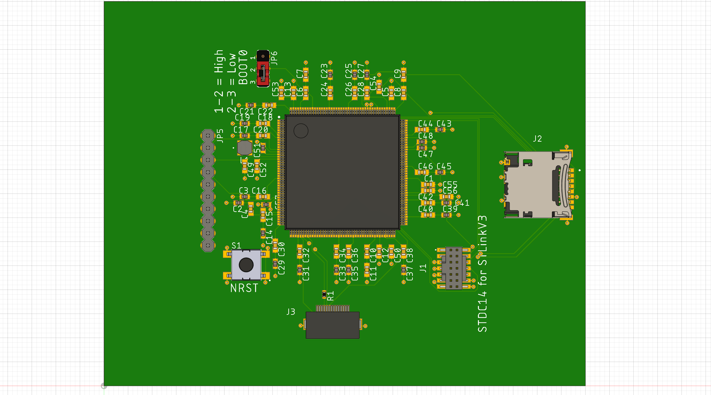
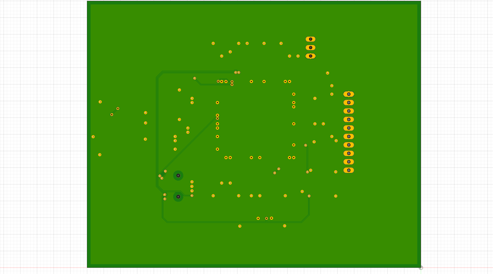

# STM32H757IIT6 Breakout

This board is aimed to evaluate the ST Microelectronics STM32H757IIT6 for use in an ultra-wideband SDR radio.

## Current Status

Not useful. This board should be usable for powering the STM, but features some unconnected pin headers.

## BOM

As of writing, the BOM comes out to $24.69 USD.

Octopart: https://octopart.com/bom-tool/58tXZVEL

## Size

TBD

## Images

All images below are of a pre-production board

### Top Right Angled View

### Top

## Bottom

## Usage

TODO
